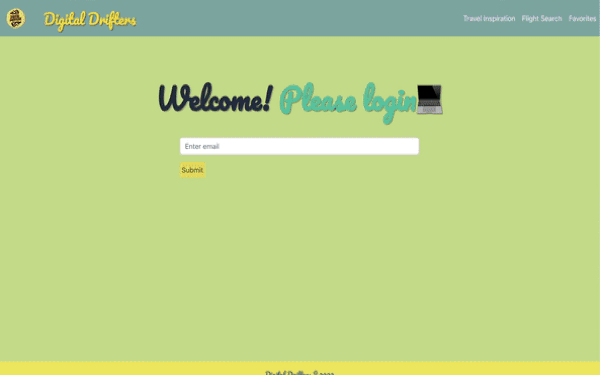

# Digital Drifters - Holiday Booking Website

## Description

Digital Drifters is a holiday booking website that allows users to research their flights directly from the website. It allows users to refine their search by city, date, and number of passengers. In addition, users can click on a page where they can get random travel inspiration and save the destinations they like to a favorites page for later use. The website is fully mobile responsive and uses React, Bootstrap, and two APIs.

Check out the live app here: https://digital-drifters.netlify.app/

## Technologies Used
* JavaScript
* React
* Node.js
* HTML
* CSS
* Bootstrap
* Netlify
* Git

## Usage

Please navigate through the website to view potential flights or to get travel inspiration, when you see a destination you like, favourite it to add it to the favourites page, and come back later to review them. If you want to immediately view flights from destinations in your favourites bar, there is a button to do so. 

## Credits

Angelina Stanzione 
Connie Hinojosa 
Tamara Joniec 
Lily Halladay

## License

MIT License
---

